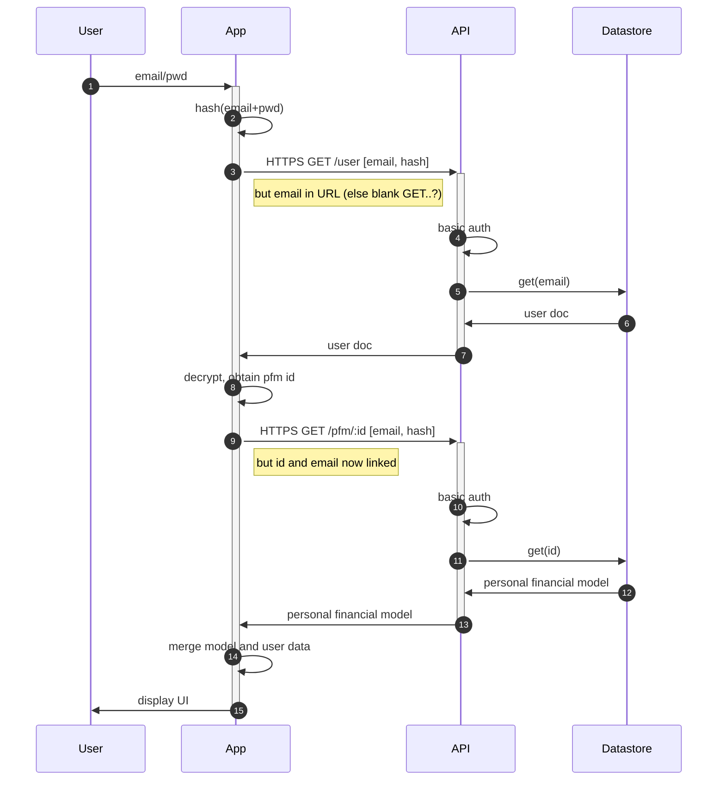

# Authentication Choice
* based on [this advice](https://www.securitydrops.com/the-web-api-authentication-guide/)
## HTTP Basic Auth
* **mechanism**
  * Header: Authorization: Basic base64(username:password)
  * browser caches credentials    
* **pros**
  * simple
* **cons**
  * confidentiality relies on TLS
  * CSRF protection needed
  * replay protection relies on TLS
  * integrity protection relies on TLS  
  * no session management
  * [complex logout](https://stackoverflow.com/questions/233507/how-to-log-out-user-from-web-site-using-basic-authentication)  
    
## HTTP Digest Auth
* **Mechanism**
  * calculate nonce for each request
* **cons**
  * real password known at each end
  * CSRF protection needed as browser does everything
  * browser suport
    
## Cookies
* **Mechanism**
  * a storage mechanism
  * handled by browser
  * set-cookie headers with flags
  * use samesite and secureflag  
    

## Bearer Tokens
* **mechanism**
  * Authorization: Bearer ujoomieHe2ZahC5b
  * a cryptographically signed token  
  * use with sessions possibly?   
* **pros**
  * excellent CSRF as browser does not do it
  * standards - OAth
* **cons**
  * jwt specifically
    * cannot invalidate/update stateless JWT's
    * size/security issues dependent on where stored
    * still headers
  * complexity - access tokens and refresh tokens?
   
## Signature Schemes
* **Mechanism**
  * pre-signed URL?
    
## TLS Client Certificates
* **Mechanism**
  * need to control server TLS termination, so out of the question
    
    

| Scheme | Complexity | Confidentiality | CSRF Protection | Replay Protection | Integrity Protection | Session | Log Out |
| --- | --- | --- | --- | --- | --- | --- | --- |
| HTTP Basic Auth | + | X  | X | X | X | X | X |
| HTTP  Digest Auth | X | X | X | + | + | X | X |
| Cookies |  + | X | + (same site) | X | X | + | X |
| Bearer Tokens | + | X | ++ | X | X | (+X) | X |
| Signature Schemes | | | |
| TLS Client Certificates| | | |
| HMAC | | | |

# Login

## Stateless Server - Basic Auth

## Stateless Server - stateless tokens?
* short timescales to avoid expiry issues?

##Stateful Server - cookies or bearer tokens
* using [GCP redis equivalent](https://cloud.google.com/memorystore/) for state data
* way, way, way too expensive $150+ a month!
* standard sql?  tiny mysql $10 else $50+
* or perhaps [Datastore](https://www.npmjs.com/package/@google-cloud/connect-datastore) again?
* or [Firestore](https://www.npmjs.com/package/@google-cloud/connect-firestore)?

# Registration

# Password Reset

# User Deletion

# Data Management
* how deal with orphan pfm records?
  * monitor number of user docs vs pfm records
  * store last access date?
* versioning  