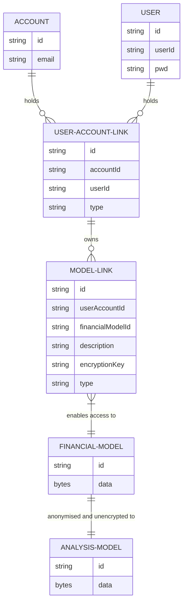

# Data

## Account
* the commercial relationship with my-finances
* subscription details

## User
* the runtime user identity
* userId is public hash generated from email, so **can change** 
* pwd is also a hash

## User Account Link
* associates a user with an account
* type - enumeration

## Model Link
* associates a user with a model
* type - enumeration 'read-only', 'read-write'
* description - encrypted by user
* encryption key for financial model - encrypted by user

## Financial Model
* 'no knowledge' encrypted
* holds personal information for model

## Analysis Model
* anonymous
* analyzable (therefore SQL?)
* not sure of format yet

# Use Cases
| | Description | Solution |
| --- | --- | --- |
| 1. | private user | userAccountType: 'personal' |
| 2. | individual IFA | userAccountType: 'personal' |
| 3. | group IFA | account only |
| 4. | group IFA member |  userAccountType: 'member' |
| 5. | IFA client | userAccountType: 'client' |
| 6. | private user, gives access to IFA | userAccountType: 'client' |

# Database
* account / user / model-link / financialModel relations need foreign keys
  * structured => SQL
  * but flexibility of no-sql might be good for development  
  * definitely transactional
* analysis model needs to be uploaded to BigQuery / whatever analysis engine
* but all db's in GCP relatively pricey
  
## Firestore
* except [Firestore](https://cloud.google.com/firestore)
* pros  
  * generous free tier for runtime
  * also offers synchronisation functionality (real-time updates) - might answer config issues
  * has [security rules](https://cloud.google.com/firestore/docs/security/get-started) for trigger-like functionality  
* cons
  * (almost) no CLI
  * so clunky manual setup - see [setup](./firebase-setup.md)
  * available regions do not match cheapest regions (e.g. europe-west1)  
  * no creation scripts!
* see [Firestore setup](./firestore-setup.md)  

### Firestore Data Structure
**Only Personal** users for now
* `/users` collection
  * `user` doc
    * `account` map
      * email
    * `financialModels` - sub collection
  
The future:
* create separate `account` collection
* create `analysisModels` collection