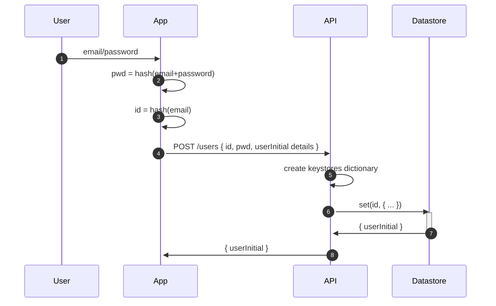
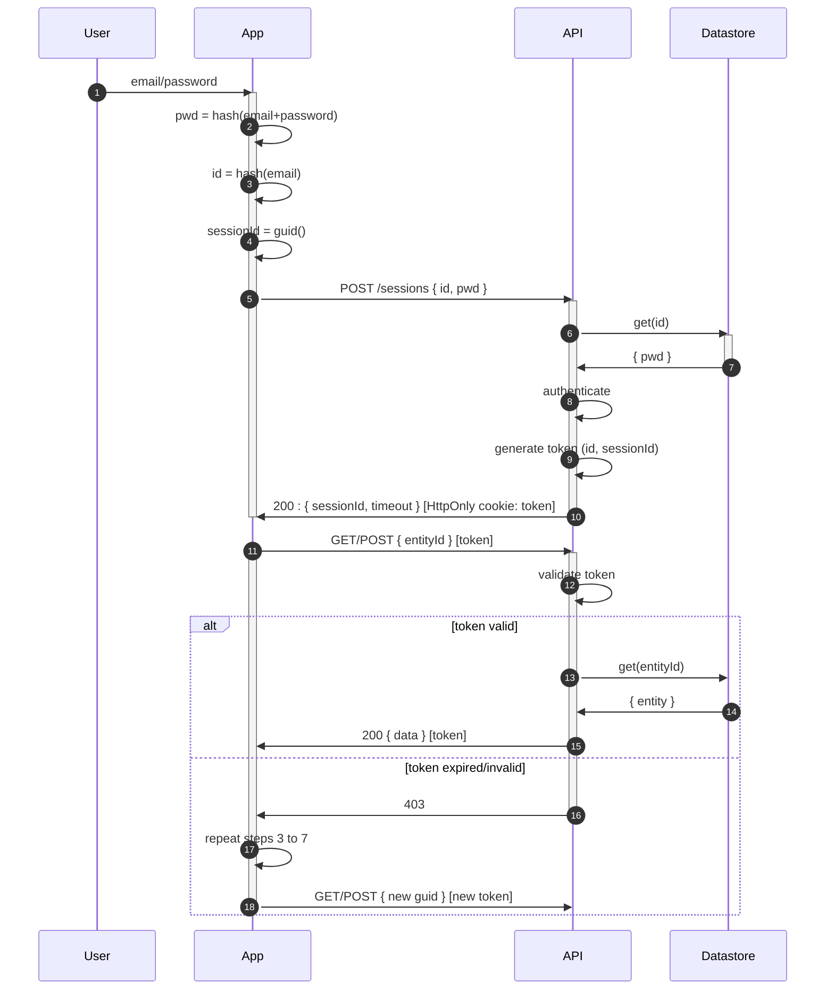

# Stateless Server Interactions
# Create User

```mermaid
sequenceDiagram
  autonumber
  User->>App: email/password
  activate App
  App->>App: pwd = hash(email+password)
  App->>App: id = hash(email)
  App->>API: POST /users { id, pwd, userInitial details }
  API->>API: create keystores dictionary
  activate API
  API->>Datastore: set(id, { ... })
  activate Datastore
  Datastore->>API: { userInitial }
  deactivate Datastore
  API ->>App: { userInitial }
```  

# Create Session

```mermaid
sequenceDiagram
  autonumber
  User->>App: email/password
  activate App
  App->>App: pwd = hash(email+password)
  App->>App: id = hash(email)
  App->>App: sessionId = guid()
  App->>API: POST /sessions { id, pwd }
  activate API
  API->>Datastore: get(id)
  activate Datastore
  Datastore->>API: { pwd }
  deactivate Datastore
  API->>API: authenticate
  API->>API: generate token (id, sessionId) 
  API->>App: 200 : { sessionId, timeout } [HttpOnly cookie: token]
  deactivate API
  deactivate App
  App->>API: GET/POST { entityId } [token]
  activate App
  activate API
  API->>API: validate token
  alt token valid
  API->>Datastore: get(entityId)
  activate Datastore
  Datastore->>API: { entity }
  activate Datastore
  API->>App: 200 { data } [token]
  else token expired/invalid
  API->>App: 403
  deactivate API
  App->>App: repeat steps 3 to 7
  App->>API: GET/POST { new guid } [new token]
  deactivate App
  end
```
